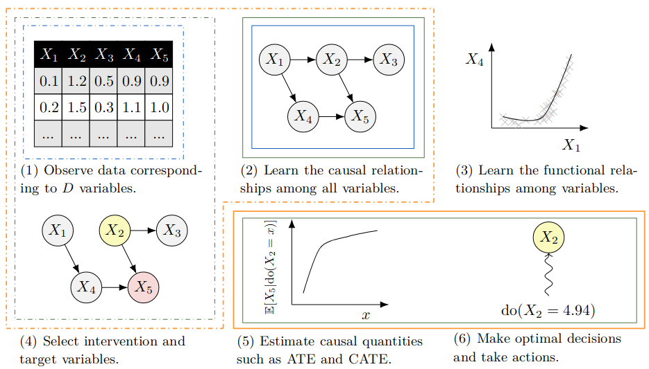

# 🎓 CS-673 Project (Intro to Deep Generative Models)

---

## 📜 Overview

The task of **Causal Discovery** is to uncover the true DAG \(G\) given a dataset \(D\) such that \(pD ∼ G\). Since the work of [ZARX18], which transformed the task of causal discovery to a continuous optimization program with acyclicity constraints, significant attention has shifted to deep learning-based causal discovery algorithms.

In this project, we select **DECI (Deep End-to-end Causal Inference)**, a SOTA causal discovery algorithm for iid observational data by [GAF+22], a variational inference model modeling exogenous noise as a normalizing flow.

Since the literature on causal discovery algorithms for time-series data using deep learning techniques is quite limited and virginal, we opt to implement DECI on time-series data using lagged cross-sectional data. Finally, we evaluate our performance against non-deep-learning-inspired algorithms (PCMCI, PCMCI(+) etc.) on time-series synthetic data with known ground truth causal graph [LKSS20].

---



---

## 📚 References

- [**GAF+22**] Tomas Geffner, Javier Antoran, Adam Foster, Wenbo Gong, Chao Ma, Emre Kiciman, Amit Sharma, Angus Lamb, Martin Kukla, Nick Pawlowski, et al. *Deep end-to-end causal inference*. arXiv preprint arXiv:2202.02195, 2022.
- [**LKSS20**] Andrew R. Lawrence, Marcus Kaiser, Rui Sampaio, and Maksim Sipos. *Data generating process to evaluate causal discovery techniques for time series data*. Causal Discovery Causality-Inspired Machine Learning Workshop at Neural Information Processing Systems, 2020.
- [**VCB22**] Matthew J Vowels, Necati Cihan Camgoz, and Richard Bowden. *D’ya like DAGs? a survey on structure learning and causal discovery*. ACM Computing Surveys, 55(4):1–36, 2022.
- [**ZARX18**] Xun Zheng, Bryon Aragam, Pradeep K Ravikumar, and Eric P Xing. *Dags with NO-TEARS: Continuous optimization for structure learning*. Advances in Neural Information Processing Systems, 31, 2018.

---

## 🛠️ Setup Instructions

There are two separate environments that need to be configured to reproduce this project: **CDML** and **DECI (causica)**.

### 🐍 Creating Virtual Environments

You may create the virtual environments with their respective requirements using the provided `.yml` files, using for example your Anaconda installation, on your shell as

1. For CDML:
   ```conda env create -f environment_cdml.yml
   ```

2. For causica:
   ```conda env create -f environment_causica.yml
   ```

### 📌 Environment Details

- The first environment runs on Python 3.8.19.
- The second environment runs on Python 3.10.1.

---

Enjoy! 🚀
